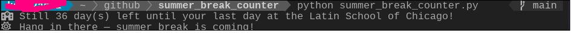

# 🎓 D-Day to Summer Break

This is a simple D-Day countdown script written in Python.  
It calculates how many days are left until my last working day at the Latin School of Chicago (May 29, 2025).

Just run the script and it will tell you how many days are left 😎

---

## 🧪 Sample Output

🏫 Still 38 day(s) left until your last day at the Latin School of Chicago!  
☀️ Hang in there — summer break is coming!

